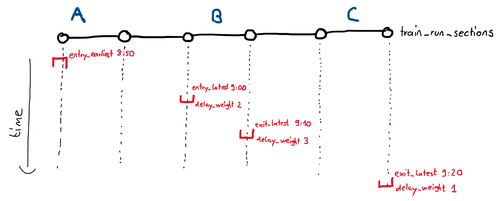
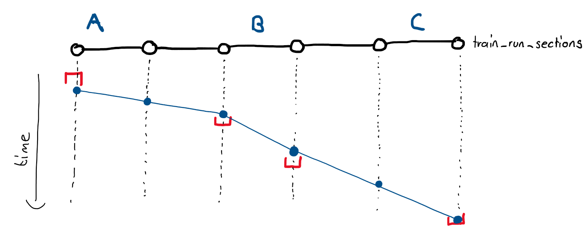
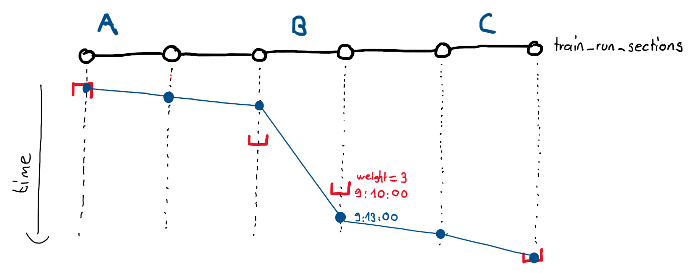
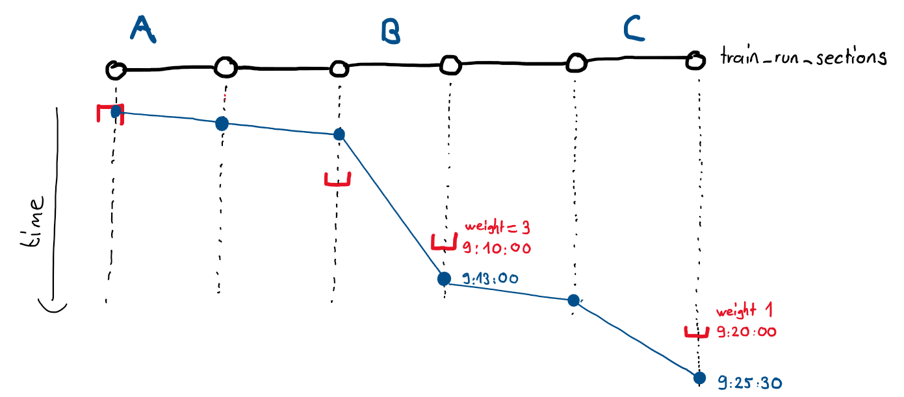
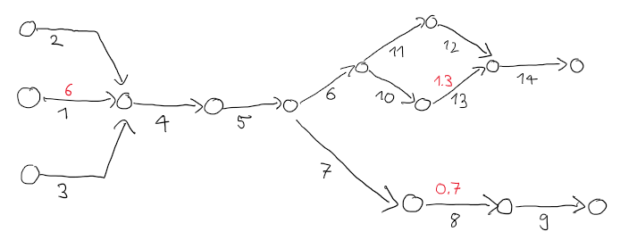
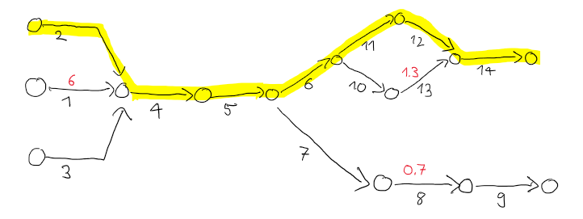
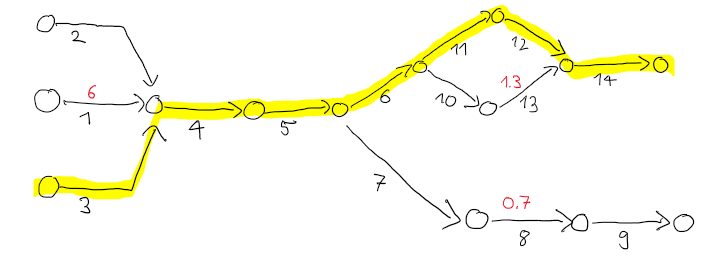
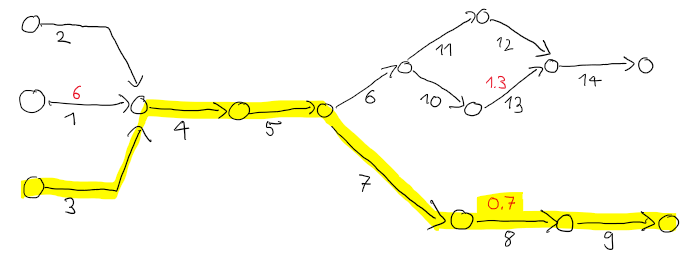
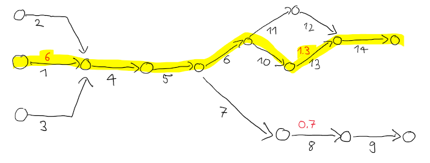

# Business Rules
This document describes the rules that have to be observed in order that a _solution_ to a _problem instance_ is considered valid.

Your solver will need to make sure that the solutions it produces observe these rules.

We categorize the rules roughly in two groups:
* _Consistency rules_, which mostly check technical conformity to the data model
* _Planning rules_,  which represent the actual business rules involved in generating a timetable

## Concistency Rules

| # | Rule Name         | Rule Definition   | Remarks |
| - | -------           | -----             | ----    |
|1|problem_instance_hash present      | the field *problem_instance_hash* is present in the solution and has the correct value (namely that of the problem instance that this solution refers to)                          | |
| 2| each train is scheduled       | For every *service_intention* in the _problem_instance_, there is exactly one *train_run* in the solution  | |
| 3 | ordered *train_run_sections*       | For every *train_run*, the field *sequence_number* of the *train_run_sections* can be ordered as a strictly increasing sequence of positive integers  | in other words, the *sequence_numbers* are _unique_ among all *train_run_sections* for a *train_run*.  Typically, it is natural to also list the *train_run_sections* in increasing order in the JSON file, such as is the case for the [sample solution](../sample_files/sample_scenario_solution.json). However, strictly speaking de-/serialization from/to JSON need not preserve orders. Having an explicit *sequence_number* is therefore advisable.   Example: The [sample solution](../sample_files/sample_scenario_solution.json):     |
| 4 | Reference a valid *route*, *route_path* and *route_section*      | each *train_run_section* references a valid (i.e. one that exists) *route* for this *service_intention*, *route_path* and *route_section*  | for example, in the [sample_solution](../sample_files/sample_scenario_solution.json):    |
| 5 | *train_run_sections* form a path in the route graph      | If two *train_run_sections* A and B are adjacent according to their *sequence_number*, say B directly follows A, then the associated *route_sections* A' and B' must also be adjacent in the route graph, i.e. B' directly follows A'.  | In other words, the *train_run_sections* form a path (linear subgraph) in the route graph. Check the illustrations in the [Output Data Model description](output_data_model.md#train_runs). |
| 6 | pass through all *section_requirements*      | a *train_run_section* references a *section_requirement* if and only if this *section_requirement* is listed in the *service_intention*. | for example, in the [sample solution](../sample_files/sample_scenario_solution.json), the *train_run_sections* for *service_intention* 111 have references to the *section_requirements* A, B and C. But the *train_run_sections* for *service_intention* 113 only reference *section_requirements* A and C:      This is because in the [sample instance](../sample_files/sample_scenario.json) the *service_intention* for 113 does not __have__ a *section_requirement* for the *section_marker* 'B', but only for 'A' and 'C'   
| 7 | consistent *entry_time* and *exit_time* times      | for each pair of immediately subsequent *train_run_sections*, say S1 followed by S2, we have S1.*exit_time* = S2.*entry_time* | recall the ordering of the *train_run_sections* is given by their *sequence_number* attribute. Again, look at the [sample solution](../sample_files/sample_scenario_solution.json) as an example:   |

 

## Planning Rules

| # | Rule Name         | Rule Definition   | Remarks |
| - | -------           | -----             | ----    |
| 101 | Time windows for _latest_-requirements     | If a *section_requirement* specifies a *entry_latest* and/or *exit_latest* time then the event times for the *entry_event* and/or *exit_event* on the corresponding *train_run_section* __SHOULD__ be <= the specified time.   If the scheduled time is later than required, the solution __will still be accepted, but it will be penalized__ by the objective function, see [below](#objective-function).    __Important Remark:__ Among the 12 business rules, this is the _only_ 'soft' constraint, i.e. a rule that _may_ be violated and the solution still accepted.   In some cases, for example for [problem instance 05](../problem_instances/05_V1.02_FWA_with_obstruction.json), it is *impossible* to schedule all trains satisfying all 12 business rules. In order to obtain feasible solutions, you have no other choice than to delay some of the trains (i.e. violating some *entry_latest*/*exit_latest* requirements). In such cases, you should of course try to _minimize_ the resulting delay penalty.        | for example, in the [sample instance](../sample_files/sample_scenario.json) for *service_intention* 111 there is a requirement for *section_marker* 'C' with a *exit_latest* of 08:50:00. In the [sample solution](../sample_files/sample_scenario_solution.json) the corresponding *exit_event* is scheduled at 08:32:08, so well before the required time. Any time not later than 08:50:00 would be just as fine. Any time >= 08:50:01 would incur a lateness penalty as defined in the [objective function](#objective-function) below.   __section_requirement:__    __solution:__   
| 102 | Time windows for *earliest*-requirements     | If a *section_requirement* specifies an *entry_earliest* and/or *exit_earliest* time, then the event times for the *entry_event* and/or *exit_event* on the corresponding *train_run_section* __MUST__ be >= the specified time          | for example, in the [sample instance](../sample_files/sample_scenario.json) for *service_intention* 111 there is a requirement for *section_marker* 'A' with an *entry_earliest* of 08:20:00. Correspondingly, in the [sample solution](../sample_files/sample_scenario_solution.json) the corresponding *entry_event* is scheduled at precisely 08:20:00. This is allowed. But 08:19:59 or earlier would not be allowed; such a solution would be rejected.     *section_requirement*:      __solution__:  |
| 103 | Minimum section time     | For each *train_run_section* the following holds:   texit - tentry >= minimum_running_time + min_stopping_time, where   tentry, texit are the entry and exit times into this *train_run_section*, *minimum_running_time* is given by the *route_section* corresponding to this *train_run_section* and *min_stopping_time* is given by the *section_requirement* corresponding to this *train_run_section* or equal to 0 (zero) if no *section_requirement* with a *min_stopping_time* is associated to this *train_run_section*. | For example, take *train_run_section* #3 for train 111 in our sample solution. It refers to *route_section* 111#5. This *route_section* has a *minimum_running_time* of 32 seconds, accoring to the sample scenario. Furthermore, on this *train_run_section* we claim to satisfy *section_requirement* for *section_marker* 'B'. That *section_requirement* requires a *min_stopping_time* of 3 minutes. In total, we need to spend at least 3min and 32s on this *train_run_section* to satisfy this rule. Luckily, we actually spend 8min and 35s (from 08:21:25 until 08:30:00), so we are fine.   __section_requirement:__   __route_section:__    __solution:__  |
| 104 | Resource Occupations     | Let S1 and S2 be two *train_run_sections* belonging to *distinct* service_intentions T1, T2 and such that the associated *route_sections* occupy at least one common resource.  Without loss of generality, assume that T1 enters section S1 before T2 enters S2, i.e.   tS1, entry < tS2, entry.   Then for _each commonly occupied resource_ R, the following must hold:   tS2, entry >= tS1, exit + dR, release   where dR, release is the *release_time* (*freigabezeit*) of resource R| In prose, this means that *if* a train T1 starts occupying a resource R before train T2, then T2 has to wait until T1 releases it (plus the release time of the resource) before it can start to occupy it.   This rule explicitly need *not* hold between train_run_sections *of the same train*. The problem instances are infeasible if you require this separation of occupations also among *train_run_sections* of the same train.   __Example:__ We will see some examples of what this means in the [worked example](a_worked_example.md)
| 105 | Connections     | Let C be a connection defined in *service_intention* SI1 onto *service_intention* SI2 with *section_marker* M and let dC be the connection's *min_connection_time*.   Let S1 be the *train_run_section* for SI1 where the connection will take place (i.e. the section which has 'M' in the *section_requirement* attribute) and S2 the same for SI2. Then the following must hold:  tS2, exit - tS1, entry >= dC,   where, again, tS1, entry denotes the time for the *entry_event* into *train_run_section* S1 and tS2, exit the time for the *exit_event* from *train_run_section* S2. | Example: The first problem instance with connections is [instance 02](../problem_instances/02_a_little_less_dummy.json). Specifically, let's look at the following connection in 'WAE_Halt' from 18013 to 18224, with a minimum connection time of 2minutes and 30s:    We take the [sample solution for this instance](../problem_instances/sample_solutions/solution_02_a_little_less_dummy.json). The *entry_time* of 18013 into the relevant *train_run_section* is 06:42:12:  __solution for 18013__:     The *exit_time* of 18224 from its relevant *train_run_section* is 06:48:04:  __solution for 18224__:    Therefore, we have a time difference of almost 6 minutes between the two events, well above the minimum time span of 2.5 minutes.

## Objective Function
The objective function is used by the grader to determine how "good" a solution is. We give a more exact formula below, but basically it is calculated as the __weighted sum of all delays plus the sum of routing penalties__.
A _delay_ in this context means a violation of a _section_requirement_ with an _exit_latest_ or _entry_latest_ time. Each such violation is multiplied by its _entry_delay_weight_/_exit_delay_weight_ and then summed up to get the total delay penalties.  

__Remark:__ A _missing_ solution in a submission will incur a penalty of 10'000 points. A solution that violates any of the eleven _mandatory_ business rules (all except #101) will be treated like a missing solution.

The best possible objective value a solution can obtain is 0 (zero). A value > 0 means some _latest_entry_/_latest_exit_ _section_requirement_ is not satisfied in the solution, or a route involving _routing_sections_ with _penalty_ > 0 was chosen.

The "formula" for the objective function is as follows:

where:
* The first sum is taken over all _service_intentions_ **SI** and all _section_requirements_ **SR** therein,
* The second sum is taken over all _train_run_sections_ **TRS**,
* **entry_delay_weightSR** stands for the _entry_delay_weight_ specified for this particular _section_requirement_. If the _section_requirement_ does not specify an _entry_delay_weight_, then it is assumed to be = 0.
* **tentry** denotes the scheduled time in the solution for the _entry_event_ into the _train_run_section_ associated to this _section_requirement_,
* **entry_latestSR** denotes the desired latest entry time specified in the field _entry_latest_ of the _section_requirement_  _Note_: If the _section_requirement_ does not specify an _entry_latest_, then it is assumed to be &infin;, i.e. the **max** will be zero and the term can be ignored.
* **exit_delay_weightSR** is analogous to **entry_delay_weightSR**, except for the _exit_delay_weight_ of this particular _section_requirement_,
* **texit** denotes the scheduled time of the _exit_event_ from the _train_run_section_ associated to this _section_requirement_,
* **exit_latestSR** is analogous to **entry_latestSR**, except for the _exit_ time (as specified in _exit_latest_ of the _section_requirement_),
* **penaltyroute_sectionTRS** denotes the value of the field _penalty_ of the _route_section_ associated to this _train_run_section_.

__Remark__: All time differences are measured in seconds. The normalization constant 1/60 for the delay penalty term means that 60s of delay will incur 1 penalty point (provided all _delay_weight_ are equal to 1). In other words, we count the delay 'minutes'.

We give a couple of simple examples illustrating the calculation of the delay and routing penalties.

### Examples for Delay Penalties
Suppose the _service_intention_ has the following three _section_requirements_:
* for _section_marker_ A: _entry_earliest_ = 08:50:00
* for _section_marker_ B: 
    - _entry_latest_ = 09:00:00 with _entry_delay_weight_ = 2
    - _exit_latest_ = 09:10:00 with _exit_delay_weight_ = 3
* for _section_marker_ C: _exit_latest_ = 09:220:00 with _exit_delay_weight_ = 1

Suppose also that the routes are rather simple, namely 
* there is only one _route_ (no alterntives), 
* all its _route_sections_ have zero _penalty_ and 
* on the first _train_run_section_ we have _section_marker_ A, then a section without marker, then B, then a section without marker and finally C. 

The complete picture with the _train_run_sections_ and the respective _section_requirements_ would therefore look like this:

We now give several example solutions and the value of the objective function for them. Blue dots denote the actual _event_times_ of the solution, i.e. entry and exit times from _train_run_sections_. The blue lines joining them are purely a visualisation aid, they are not part of the solution.

#### Example 1: No Delay

In this solution, all _section_requirements_ are satisfied. The _entry_ and _exit_ times into the sections are before the desired _entry_latest_/_exit_latest_. Therefore, the delay is zero. Since there is no routing penalty, this is also its objective value:  __objective_value = 0__

#### Example 2: Do Delay
In this solution, the train runs earlier than in [Example 1](#example-1-no-delay). But this is not "better"; it does not get any "bonus points". This solution's objective value is identical to the one of Example 1, i.e.   __objective_value = 0__

#### Example 3: Delayed Departure at B
In this solution, the _exit_ from the _train_run_section_ with _section_marker_ 'B' happens only at 09:13:00. This is 3 minutes later than the desired _exit_latest_ of the _section_requirement_ for 'B'. Since the _exit_delay_weight_ is 3, for this solution we have   __objective_value = 3 * 3 = 9__

#### Example 4: Delayed Departure at B _and_ Delayed Arrival at C
In this solution, in addition to the delayed departure at B as in Example 3, we also have a delayed _exit_event_ from _section_ C, namely this event occurs 5.5 minutes after the desired _exit_latest_ of 09:20:00. The _exit_delay_weight_ for this _section_requirement_ is 1, therefore:  __objective_value = 3 * 3 + 1 * 5.5 = 14.5__

### Examples for Routing Penalties

Let's take the same routing graph as in the discussion of the [output data model](documentation/output_data_model.md#train_runs), this time augmented with some routing penalties. The route graph looks like this:
* the numbers in __black__ denote the _route_section_._id_
* the numbers in __red__ denote the _route_section_._penalty_. No number means no _penalty_ is specified for this _route_section_

#### Example 1: No Routing Penalty

In the solution, the route highlighted in __yellow__ was chosen.
This route passes through the _route_sections_ 2 -> 4 -> 5 -> 6 -> 11 -> 12 -> 14. None of the _sections_ on this route specify a _penalty_. Since a missing _penalty_ is equivalent to a penalty of zero, the routing penalty for the whole route is also zero.

#### Example 2: Also no Routing Penalty
Also the following solution does not involve any _route_sections_ with positive _penalty_ and therefore does not incur any routing penalty either. It is an equally good route as the one in Example 1.

#### Example 3: Positive Routing Penalty
This solution chooses a route with one _route_section_ with positve _penalty_, namely _route_section_ 8 with _penalty_ 0.7.

The routing penalty for this route is therefore 0.7

#### Example 4: Positive Routing Penalty
This solution chooses a route with two _route_section_ with positve _penalty_, namely 
* _route_section_ 1 with _penalty_ 6
* _route_section_ 13 with _penalty_ 1.3

The routing penalty for this route is therefore 6 + 1.3 = 7.3

